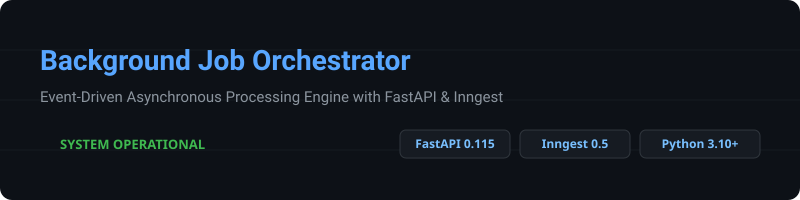
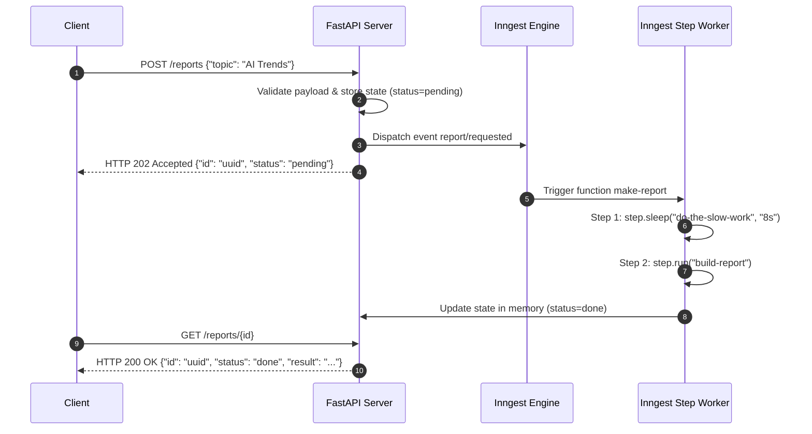

<p align="center">
  
  
  
  
</p>

---

## Architectural Overview

The Background Job Orchestrator is designed to handle long-running computing tasks without degrading web server responsiveness or blocking client HTTP connections. 

### Core Architectural Principles

1. **Non-Blocking HTTP Ingestion (HTTP 202 Accepted)**  
   When a client issues a request to generate a report via `POST /reports`, the application validates the payload immediately. Upon successful validation, it generates a unique tracking identifier, persists an initial state (`pending`) in memory, and dispatches an event (`report/requested`) to the event bus via `inngest_client.send`. The API returns an **HTTP 202 Accepted** response payload within milliseconds, freeing the client connection instantly.

2. **Event-Driven Asynchronous Execution**  
   The heavy processing (simulated heavy calculation, external API integrations, or PDF compilation) is handled asynchronously out-of-band by Inngest background workers. The background function executes steps deterministically with state persistence across retries.

3. **Status Polling Pattern**  
   Clients monitor job completion asynchronously by querying `GET /reports/{id}`. State transitions from `pending` to `done` (or `failed`) are reflected dynamically in the in-memory data store.

### Request Lifecycle Sequence



---

## Service Operations

### Prerequisite Environment Setup

Ensure Python dependencies are installed:

```bash
pip install fastapi uvicorn inngest httpx
```

### Server Startup Commands

Two concurrent server processes are required for local execution:

#### 1. FastAPI Application Server

```bash
uvicorn main:app --reload
```
- **Service Endpoint:** `http://localhost:8000`
- **Interactive Documentation:** `http://localhost:8000/docs`

#### 2. Inngest Development Server

```bash
npx inngest-cli@latest dev -u http://localhost:8000/api/inngest
```
- **Dev Dashboard:** `http://localhost:8288`
- **Inngest Route:** `http://localhost:8000/api/inngest`

---

## System Interface Specifications

### API Endpoints

| Method | Route | Description | Response Status Codes |
| :--- | :--- | :--- | :--- |
| `GET` | `/health` | Application health and status verification | `200 OK` |
| `POST` | `/reports` | Dispatches background report generation event | `202 Accepted`, `400 Bad Request` |
| `GET` | `/reports/{id}` | Retrieves current processing status and result | `200 OK`, `404 Not Found` |
| `ALL` | `/api/inngest` | Inngest communication handler endpoint | `200 OK` |

### Inngest Background Functions

| Function ID | Trigger Specification | Execution Workflow | Retry Policy |
| :--- | :--- | :--- | :--- |
| `say-hello` | Event: `test/hello` | Performs 5-second sleep step and returns verification message | Standard (4 attempts) |
| `make-report` | Event: `report/requested` | Performs 8-second sleep step, executes report generator, updates memory state | Configured (2 retries) |
| `heartbeat` | Cron: `* * * * *` | Runs every minute to calculate summary statistics of report states | Standard (4 attempts) |

---

## Verification & Execution Examples

### 1. Dispatching a Report Request

```bash
curl -X POST http://localhost:8000/reports \
  -H "Content-Type: application/json" \
  -d '{"topic": "Machine Learning"}'
```

**Response (Sub-second HTTP 202 Accepted):**

```json
{
  "id": "e4f8b91a-72cd-4b92-9a10-2b10a3c8e100",
  "status": "pending"
}
```

### 2. Status Polling: Initial State (Pending)

```bash
curl -i http://localhost:8000/reports/e4f8b91a-72cd-4b92-9a10-2b10a3c8e100
```

**Response:**

```http
HTTP/1.1 200 OK
content-type: application/json

{
  "id": "e4f8b91a-72cd-4b92-9a10-2b10a3c8e100",
  "topic": "Machine Learning",
  "status": "pending"
}
```

### 3. Status Polling: Completed State (Done)

```bash
curl -i http://localhost:8000/reports/e4f8b91a-72cd-4b92-9a10-2b10a3c8e100
```

**Response:**

```http
HTTP/1.1 200 OK
content-type: application/json

{
  "id": "e4f8b91a-72cd-4b92-9a10-2b10a3c8e100",
  "topic": "Machine Learning",
  "status": "done",
  "result": "Report content for Machine Learning"
}
```

### 4. Early Input Validation (HTTP 400 Bad Request)

```bash
curl -i -X POST http://localhost:8000/reports \
  -H "Content-Type: application/json" \
  -d '{"topic": ""}'
```

**Response:**

```http
HTTP/1.1 400 Bad Request
content-type: application/json

{
  "error": "Topic is required"
}
```

---

## Technical Analysis & Operational Considerations

### 1. Synchronous Input Validation vs. Asynchronous Retry Semantics

* **Synchronous Input Validation (HTTP 400 at Boundary):**  
  Malformed inputs, missing fields, or empty strings are deterministically invalid. Attempting to enqueue and retry malformed requests in a background worker consumes queue capacity, compute worker CPU cycles, and network resources unnecessarily while guaranteed to fail repeatedly. Validating requests synchronously at the API gateway level ensures zero pollution of the event queue and immediate failure feedback to the caller.

* **Asynchronous Runtime Failure Retries:**  
  Operational failures during background execution (e.g., transient network drops, rate limits, or downstream service outages) are nondeterministic. Applying retry policies with exponential backoff at the job worker level isolates transient errors from the client, ensuring eventual consistency and system resilience without blocking client connections.

### 2. Standardized Cron Schedule Specifications

* **Daily Execution at 08:00 UTC:**  
  `0 8 * * *`
* **Weekly Execution on Sundays at 22:00 UTC:**  
  `0 22 * * 0`

---

## System Inspection & Monitoring

### Inngest Dev Dashboard Interface


*Figure 1.0: Inngest Administrative Interface illustrating function execution histories, step-level timing breakdowns, automatic retry attempts, and cron triggers.*
